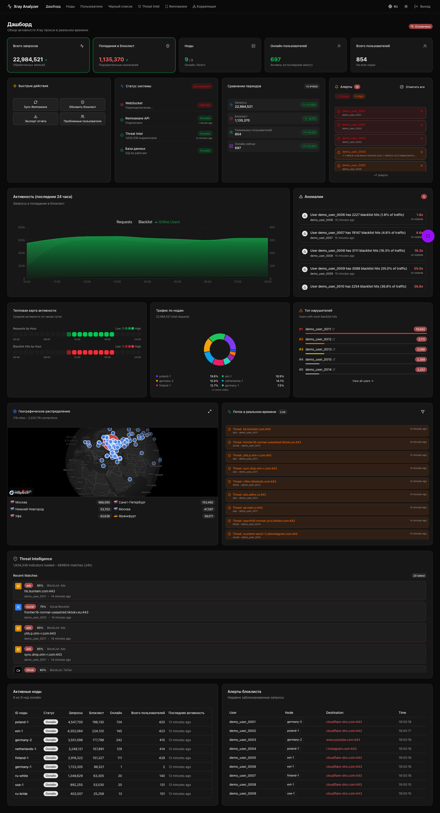
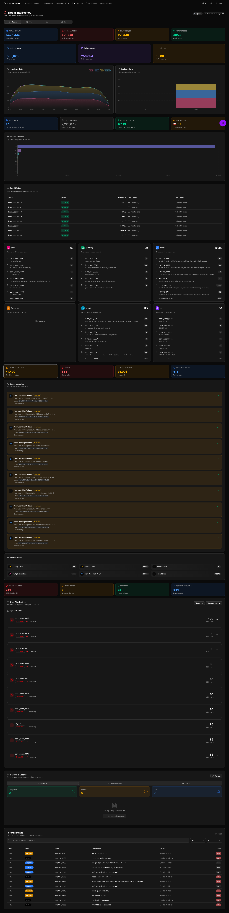
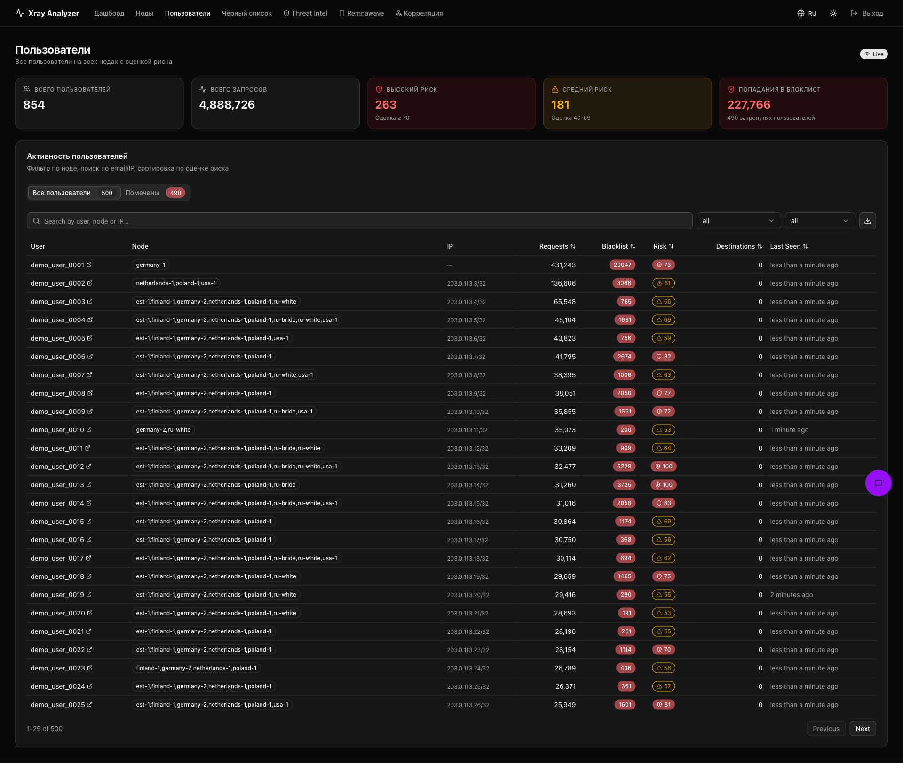
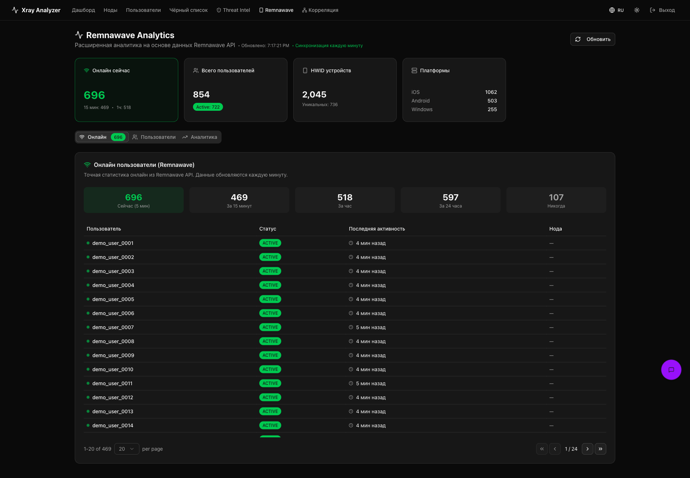
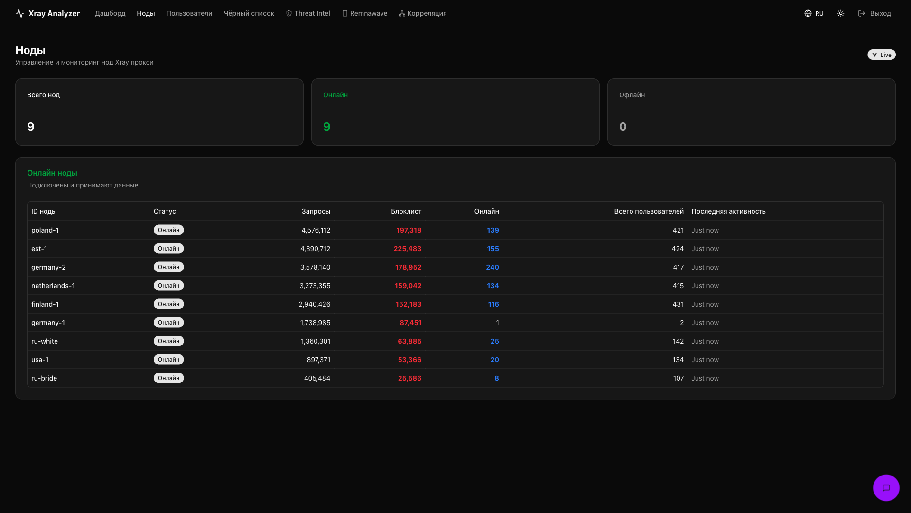
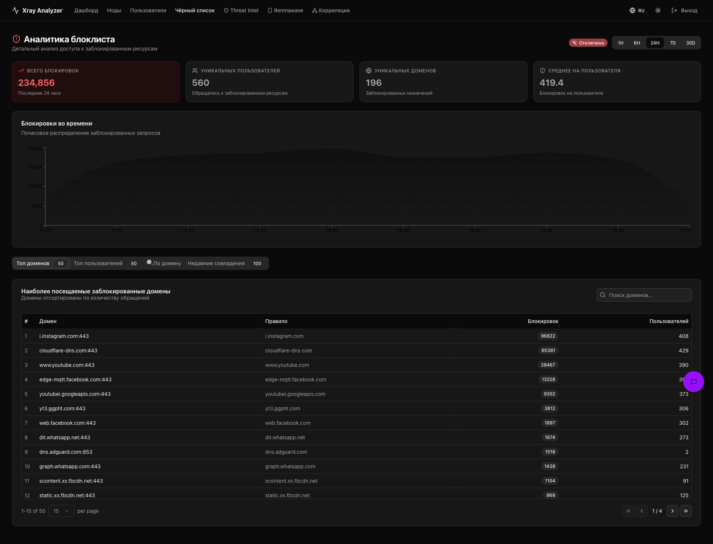

# Xray Log Analyzer

**Languages:** [Русский](./README.md) · **English**

Real-time analytics for Xray-core access logs with Remnawave panel integration. Collects access logs from all VPN nodes through WebSocket agents, aggregates them in Postgres, detects abuse / threat traffic, and renders a dashboard.

> 📦 **Step-by-step install:** [INSTALL.en.md](./INSTALL.en.md) — production-ready guide for server + agents + reverse-proxy.

## Contents

- [Features](#features)
- [Screenshots](#screenshots)
- [Architecture](#architecture)
- [Tech stack](#tech-stack)
- [Quick install — server](#quick-install--server)
- [Quick install — agent](#quick-install--agent-on-every-xray-node)
- [Configuration reference](#configuration-reference)
- [Operations](#operations)
- [Troubleshooting](#troubleshooting)
- [Development](#development)

## Features

- **Real-time ingest** — agents on every node tail `access.log` via `inotify` and stream batches (gzip, WebSocket) to the server
- **Postgres storage** with daily partitioning for hot tables (`bridged_flows`, `alerts`, `threat_matches`, ...). Daily DROP PARTITION → zero bloat
- **Threat intel** — 1.5M+ indicators (ads, malware, casino, social, tor, blocklist-fraud), alerts when thresholds are exceeded
- **Bridge correlation** — time-based fan-out for bridge-fronted exit nodes (RU bridge → German exit); resolves synthetic email IDs back to real Remnawave UUIDs through the `remna_users` lookup
- **Remnawave sync** — every 1–5 min pulls users / nodes / hwid devices / online stats from the panel API, keeping the dashboard in sync with the panel
- **Web UI** built with Next.js (RU + EN, dark theme, language switcher) — dashboard, threat-intel breakdown, per-user details, abuse analytics, geo map
- **Telegram alerts** — threat alerts enriched with categories and context
- **AI assistant** — built-in chat for queries like "find abusers in the last hour"

## Screenshots

> All usernames / UUIDs / IPs in the screenshots are masked (demo data). The real UI looks exactly the same.

### Dashboard

Live metrics, system status, anomalies, geo map, real-time feed, active nodes, blacklist alerts.



### Threat Intelligence

1.5M+ indicators (ads, malware, casino, tor, blocklist-fraud), categories, alerts, recent matches, top countries.



### Users

All users from all nodes with risk score, search by email / IP, filters, export.



### Remnawave

Extended analytics on top of the Remnawave API: online now / 15 min / 1h / 24h, HWID devices, platforms.



### Nodes

VPN node management and monitoring: connection status, request rate, blacklist hits, online users.



### Blacklist

Detailed block analytics: top domains, top users, time series, search.



## Architecture

```
                    ┌──────────────────────────────────────────┐
                    │  Every Xray node (Remnawave node)        │
                    │  ┌─────────────────────────────────┐     │
                    │  │  xray-log-agent (docker)        │     │
                    │  │  - reads /var/log/remnanode/    │     │
                    │  │    access.log via inotify       │     │
                    │  │  - batches 1000/5s, gzip        │     │
                    │  │  - WebSocket → server           │     │
                    │  └─────────────────────────────────┘     │
                    └──────────────────────┬───────────────────┘
                                           │
                                           │ WSS
                                           ▼
                    ┌──────────────────────────────────────────┐
                    │  Main analyzer server                    │
                    │  ┌────────────────────────────────────┐  │
                    │  │ analyzer-server (Go + Next.js)     │  │
                    │  │ :8237 (WS+API)  :3925 (UI)         │  │
                    │  └─────────────┬──────────────────────┘  │
                    │                │                          │
                    │   ┌────────────┴────────────┐             │
                    │   ▼                         ▼             │
                    │  postgres:17           redis:7            │
                    │  (analytics DB)        (L2 cache)         │
                    └──────────────────────────────────────────┘
                                           │
                                           │ HTTP API sync
                                           ▼
                    ┌──────────────────────────────────────────┐
                    │  Remnawave panel (separate server)       │
                    │  - users, nodes, subscriptions           │
                    │  - XTLS-tracked online counts            │
                    └──────────────────────────────────────────┘
```

**Key server ports:**
- `8237/tcp` — WebSocket for agents + REST API (internal)
- `3925/tcp` — Next.js UI (internal)
- A reverse-proxy (Caddy / nginx) terminates TLS and routes:
  - `analyzer.example.com/ws*` → `:8237/ws*` (agents)
  - `analyzer.example.com/api/*` → `:8237/api/*` (UI → API)
  - `analyzer.example.com/health` → `:8237/health`
  - `analyzer.example.com/*` → `:3925` (UI)

## Tech stack

- **Server**: Go 1.25, Postgres 17, Redis 7, Next.js 16 (React 19, TypeScript, Tailwind 4)
- **Agent**: Go 1.21, gorilla/websocket, fsnotify
- **Storage**: Postgres with daily partitioning, BRIN indexes on `ts`
- **Auth**: Bearer tokens (separate ones for UI/API and for the agent WebSocket)
- **i18n**: next-intl with RU/EN bundles, cookie-based persistence

---

## Quick install — server

A single script installs Postgres + Redis + analyzer-server from source. Supports Ubuntu 22.04+ / Debian 12+. Works on bare metal, a VM, or a container with Docker access.

```bash
git clone https://github.com/qwertyhq/xray-analyzer.git /opt/xray-analyzer
cd /opt/xray-analyzer
sudo bash scripts/install-server.sh
```

After install, the script:
1. Installs Docker + docker-compose-plugin (if missing)
2. Generates random `API_TOKEN`, `AGENT_TOKEN`, `POSTGRES_PASSWORD` into `.env`
3. Builds images (analyzer-server from local Go + Next.js sources)
4. Brings the stack up via `docker compose up -d`
5. Waits for healthchecks and prints endpoints + tokens

**What you need to configure manually after install:**

Edit `/opt/xray-analyzer/.env`:

| Variable | Purpose |
|---|---|
| `REMNAWAVE_URL` | URL of your Remnawave panel (`https://panel.example.com`) |
| `REMNAWAVE_API_TOKEN` | Bearer token from panel → Settings → API |
| `TELEGRAM_TOKEN` / `TELEGRAM_CHAT_ID` | bot for alerts |
| `BRIDGE_NODE_IDS` | comma-separated list of bridge `node_id`s (if you use bridge architecture) |
| `NODE_REMNA_MAP` | mapping `agent_node_id=remnawave_name`, e.g. `est-1=Estonia,germany-1=Germany 2` |

After edits:
```bash
cd /opt/xray-analyzer
docker compose up -d
```

**Reverse-proxy.** The script does NOT configure Caddy/nginx — that's specific to your infra. A minimal Caddyfile example:

```caddy
analyzer.example.com {
    @ws path /ws*
    reverse_proxy @ws localhost:8237

    @api path /api/* /health
    reverse_proxy @api localhost:8237

    reverse_proxy localhost:3925
}
```

---

## Quick install — agent (on every Xray node)

Run on every node where Xray is running (Remnawave node, standalone VPN endpoint, etc.):

```bash
curl -fsSL https://raw.githubusercontent.com/qwertyhq/xray-analyzer/main/scripts/install-agent.sh | \
  sudo SERVER_URL="wss://analyzer.example.com/ws" \
       AUTH_TOKEN="<AGENT_TOKEN from server .env>" \
       NODE_ID="germany-1" \
       bash
```

Parameters (as env vars before `bash`):

| Variable | Required | Default | Description |
|---|---|---|---|
| `SERVER_URL` | yes | — | WSS endpoint of the analyzer server |
| `AUTH_TOKEN` | yes | — | `AGENT_TOKEN` from the server `.env` |
| `NODE_ID` | yes | hostname | unique node ID (shown in the dashboard) |
| `LOG_PATH` | no | `/var/log/remnanode` | path to the directory with `access.log` |
| `BATCH_SIZE` | no | 1000 | records per WS frame |
| `BATCH_TIMEOUT` | no | 5s | max time before a batch is flushed |

**Important for Remnawave nodes:** the `Xray` config on the node must write `access.log` to `/var/log/remnanode/access.log`. Configure it in the Config Profile in the Remnawave panel:

```json
"log": {
  "access": "/var/log/remnanode/access.log",
  "error": "/var/log/remnanode/error.log",
  "loglevel": "warning"
}
```

And add a volume in `docker-compose.yml` for the `remnanode` container:
```yaml
volumes:
  - /var/log/remnanode:/var/log/remnanode
```

The script verifies the directory exists and is non-empty.

---

## Configuration reference

### Server (.env)

```bash
# Authentication (REQUIRED, generate strong tokens)
API_TOKEN=                     # for UI and /api/* endpoints
AGENT_TOKEN=                   # for node agents over WS
POSTGRES_PASSWORD=             # postgres user password

# Remnawave integration (highly recommended)
REMNAWAVE_ENABLED=true
REMNAWAVE_URL=https://panel.example.com
REMNAWAVE_API_TOKEN=<bearer>
REMNAWAVE_SYNC_INTERVAL=1m

# Bridge architecture (if you use a moscow→germany tunnel)
BRIDGE_NODE_IDS=ru-white,ru-bride       # bridge node_ids
BRIDGE_CORRELATION_WINDOW=15s            # window for time-based fan-out
BRIDGE_INBOUND_PATTERN=^BRIDGE_.*_IN(_\d+)?$

# Node mapping (sync agent NODE_ID with Remnawave node names)
NODE_REMNA_MAP=est-1=Estonia,germany-1=Germany 2,poland-1=Poland

# Telegram alerts
TELEGRAM_ENABLED=true
TELEGRAM_TOKEN=<bot_token>
TELEGRAM_CHAT_ID=<chat_id>

# Threat detection thresholds
SUSPICIOUS_REQUEST_COUNT=5
SUSPICIOUS_TIME_WINDOW=1h

# Threat-intel feeds (defaults are fine, can be overridden)
BLACKLIST_REMOTE_URL=https://raw.githubusercontent.com/1andrevich/Re-filter-lists/main/domains_all.lst
BLACKLIST_RELOAD=5m

# AI assistant (optional, any OpenAI-compatible /v1 endpoint)
# Examples: OpenAI, Together AI, OpenRouter, Aleria, local llama.cpp/vLLM.
OPENAI_API_KEY=<key>
OPENAI_BASE_URL=https://api.openai.com/v1
OPENAI_MODEL=gpt-4o-mini

# Web UI Mapbox token for the geo map (optional)
NEXT_PUBLIC_MAPBOX_TOKEN=<token>
```

### Agent (.env)

```bash
NODE_ID=germany-1                                  # required, unique per node
SERVER_URL=wss://analyzer.example.com/ws           # required
AUTH_TOKEN=<AGENT_TOKEN from server>               # required

LOG_FILE_PATH=/var/log/remnanode/access.log        # default
BATCH_SIZE=1000                                    # records per batch
BATCH_TIMEOUT=5s                                   # max wait before send
ENABLE_COMPRESSION=true                            # gzip-compress batches
```

---

## Operations

### Logs

```bash
# Server
cd /opt/xray-analyzer
docker compose logs -f analyzer-server      # API + UI
docker compose logs -f analyzer-postgres    # DB
docker compose logs -f analyzer-redis       # Cache

# Agent (on a node)
cd /opt/xray-analyzer
docker compose -f docker-compose.agent.yml logs -f xray-log-agent
```

### Healthchecks

```bash
# Server health (includes partition check)
curl -fsS http://localhost:8237/health

# Stats endpoint (requires API_TOKEN)
curl -sS -H "Authorization: Bearer $API_TOKEN" http://localhost:8237/api/stats | jq
```

### Postgres backup

```bash
docker exec analyzer-postgres pg_dump -U xray_analyzer -Fc xray_analyzer \
  > backup-$(date +%Y%m%d-%H%M).dump
```

Or snapshot the entire volume (faster, but requires a stop):
```bash
docker compose stop analyzer-postgres
docker run --rm -v log-analyzer_analyzer-postgres-data:/d -v $PWD:/b alpine \
  tar czf /b/pg-backup-$(date +%Y%m%d).tgz /d
docker compose start analyzer-postgres
```

### Updating

For the server:
```bash
cd /opt/xray-analyzer
git pull origin main
docker compose build analyzer-server
docker compose up -d analyzer-server
```

For an agent (on every node):
```bash
cd /opt/xray-analyzer
git pull origin main
docker compose -f docker-compose.agent.yml build
docker compose -f docker-compose.agent.yml up -d --force-recreate
```

Roll agents out one node at a time, checking `nodes_connected` in `/api/stats` after each.

### Retention

Hot tables (`bridged_flows`, `alerts`, `blacklist_matches`, `threat_matches`, `anomalies`) are partitioned by day. The partition manager in analyzer-server:
- Every 6 hours, creates partitions for today + 2 days ahead
- Drops partitions older than retention (`bridged_flows: 14d`, others: `30d`)

`/health` signals if today's partition is missing OR the default partition is non-empty (either situation = the partition manager missed a window).

### Scale

At >100 nodes / >50M flows/day:
- Bump postgres `shared_buffers=4GB`, `effective_cache_size=12GB` (needs ~16 GB RAM on the VM)
- Raise `BATCH_SIZE=5000` on agents for fewer WS round-trips
- Consider pgbouncer in front of postgres
- Disk: ~150 bytes/row × 7M rows/day = ~1 GB/day, ~14 GB steady state

---

## Troubleshooting

### Agent won't connect

```bash
# On the agent node
docker compose -f docker-compose.agent.yml logs --tail 30 xray-log-agent | grep -E "error|connect"
```

Typical causes:
- `403 forbidden` → `AUTH_TOKEN` on the agent doesn't match `AGENT_TOKEN` on the server
- `connection refused` / `tls: ...` → reverse-proxy is not forwarding WebSocket (Upgrade header)
- `no such file or directory: /var/log/remnanode/access.log` → xray isn't writing access logs into that directory (see the Remnawave config profile setup above)

### Dashboard shows raw UUIDs instead of usernames

`remna_users` hasn't synced yet — wait 1–5 minutes after the first analyzer-server start. If sync isn't running:
```bash
docker compose logs analyzer-server | grep -i remnawave
```
Verify `REMNAWAVE_URL` (must be the full URL with `https://`) and `REMNAWAVE_API_TOKEN` (issued in Settings → API in the panel).

### `/api/stats` total_users doesn't match Remnawave

Sync runs every `REMNAWAVE_SYNC_INTERVAL` (default 1m). Wait for the next cycle — the numbers will converge. Stale entries (users deleted from the panel) are removed automatically after the first successful sync.

### Disk fills up

```bash
# See what's using space
docker exec analyzer-postgres psql -U xray_analyzer -d xray_analyzer \
  -c "\dt+" | sort -k7 -h -r | head -15
```

If `bridged_flows` >25 GB — the partition manager isn't running. Check `/health`:
```bash
curl http://localhost:8237/health
```
Should return `200`. If it returns `503 partition unhealthy`, look for SQL errors in partition creation/drop in the logs.

---

## Development

### Local dev

```bash
# Server
cd server
go run ./cmd/server

# Web UI
cd server/web
npm install
npm run dev
```

### Tests

```bash
cd server
DOCKER_HOST=unix:///var/run/docker.sock go test ./...
```

Tests use testcontainers-go with `postgres:17-alpine` — a throwaway postgres container is spun up per run.

---

## License and contributing

Internal project. PRs welcome — focus areas:
- New threat-intel feeds
- UI components (vanilla shadcn / Radix)
- Performance improvements

Issue tracker: https://github.com/qwertyhq/xray-analyzer/issues
